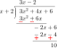
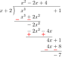

# Quadratic Expressions

Any expression of the form

$$
f(x) = ax^2 + bx + c
$$

where the constants $$a\,(\neq0)$$, $$b$$, and $$c$$ belong to the set of real numbers $$\mathbb{R}$$ while $$x$$ is a variable that can take any value from $$\mathbb{R}$$, is called a *quadratic expression*.

For any given value of $$x$$, say $$x_0$$, the above expression will have a particular *value*, which can be obtained by replacing $$x$$ by $$x_0$$ in the formula. We shall denote this value as $$f(x_0)$$; i.e.,

$$
f(x_0) = a{x_0}^2 + b{x_0} + c
$$

For example, $$f(x) = 2x^2 - 2x + 1$$ is a quadratic expression and $$f(0) = 1$$. Similarly, $$f(x) = -x^2$$ is a quadratic expression, but $$f(x) = -2x + 3$$ is *not* a quadratic expression.

---

### Roots of a Quadratic Expression

> A *root* or *zero* of a quadratic expression is that value of the variable $$x$$ for which the value of the quadratic expression is zero.

That is, $$x = \alpha$$ is a root of $$f(x) = ax^2 + bx + c$$ *if and only if* $$f(\alpha) = a\alpha^2 + b\alpha + c = 0$$. Thus, $$x = 1$$ is a root of $$f(x) = x^2 - 1$$, because $$f(1) = 0$$. 

Note: It is not necessary that every quadratic expression will have a real root. For example, $$f(x) = x^2 + x + 1$$ has no real roots.

---

## Remainder Theorem

Now, let us take an arbitrary value of $$x$$, say $$x = x_0$$. If we divide $$f(x) = ax^2 + bx + c$$ by $$(x - x_0)$$ using the long division method, we obtain the following result:

The remainder $$ax_0^2 + bx_0 + c$$ is simply the value of the expression evaluated at $$x = x_0$$, i.e., the remainder is $$f(x_0)$$. 

Denoting by $$Q(x)$$ the expression $$ax + ax_0 + b$$, we finally obtain:

$$
f(x) = (x - x_0)Q(x) + f(x_0)
$$

This result simply states that:

> **When a quadratic expression $$ax^2 + bx + c$$ is divided by a linear factor $$(x - x_0)$$, the remainder is the value of the expression evaluated at $$x = x_0$$.**

This statement is known as the **Remainder Theorem**, a fundamental result of algebra.

For instance, when $$3x^2 + 4x + 6$$ is divided by $$x+2$$, the remainder is:

$$
3(-2)^2 + 4(-2) + 6 = 10
$$

which can also be verified by direct division:

The remainder theorem is valid for any polynomial, not just quadratics. For example, if the polynomial $$P(x) = x^3 + 1$$ is divided by $$(x+2)$$, the remainder is $$P(-2) = -7$$, which can be checked:

---

## Factor Theorem

Going back to the quadratic expression $$f(x) = ax^2 + bx + c$$, if $$x_0$$ is a root of $$f(x)$$, then $$f(x_0) = 0$$ and the remainder theorem reduces to:

$$
f(x) = (x - x_0)Q(x)
$$

That is:

> **If $$x = x_0$$ is a root of $$f(x)$$, then $$(x - x_0)$$ is a factor of the quadratic expression.**

This is known as the **Factor Theorem**, a special case of the Remainder Theorem.

---

## Graph of a Quadratic Expression

Consider the quadratic expression:

$$
f(x) = ax^2 + bx + c
$$

where the constants $$a\,(\neq0)$$, $$b$$, and $$c$$ are real numbers.

Assigning $$f(x) = y$$, we plot points $$(x,y)$$ in the Cartesian plane. The collection of all such points where $$y = ax^2 + bx + c$$ forms the **graph** of the quadratic expression, which is a **parabola**.

An example is shown below:

**Figure 1:** The graph of a quadratic expression is a parabola. The graph above is of the expression:

$$
f(x) = \dfrac{200}{119} (x^2 - 16x + 39)
$$

The red dots are some calculated points.

---

## Further Investigations

### Intersection with x-axis

Finding the roots of a quadratic expression means finding values of $$x$$ such that $$f(x) = 0$$.

As the $$y$$-values correspond to $$f(x)$$, when $$f(x) = 0$$, the point lies on the $$x$$-axis. 

Thus, finding roots is equivalent to finding the intersection points of the parabola with the $$x$$-axis.

---

We can solve $$f(x) = 0$$ using the **Sridharacharya formula**. Let the roots be $$\alpha$$ and $$\beta$$. Then:

$$
f(x) = a(x - \alpha)(x - \beta)
$$

This factorization follows from **Vieta's Relations** as well:

$$
\begin{aligned}
f(x) &= a(x - \alpha)(x - \beta) \\
&= a(x^2 - (\alpha + \beta)x + \alpha\beta) \\
&= ax^2 + bx + c
\end{aligned}
$$

Depending on the discriminant $$D = b^2 - 4ac$$, three cases arise:

---

### ‣ Case I: $$b^2 - 4ac > 0$$
In this case, both $$\alpha$$ and $$\beta$$ are real. Suppose $$\alpha > \beta$$.

When $$a > 0$$:

- $$f(x) > 0$$ for $$x < \beta$$ and $$x > \alpha$$.
- $$f(x) < 0$$ between $$\beta$$ and $$\alpha$$.
- The graph cuts the $$x$$-axis at two points.
- The parabola opens **upward**.

When $$a < 0$$:

- $$f(x) < 0$$ for $$x < \beta$$ and $$x > \alpha$$.
- $$f(x) > 0$$ between $$\beta$$ and $$\alpha$$.
- The graph cuts the $$x$$-axis at two points.
- The parabola opens **downward**.

**Figure 2:** Possible shapes when the discriminant is positive ($$b^2-4ac>0$$).

### ‣ Case II: $$b^2 - 4ac = 0$$

Here, there is a single real root $$\alpha$$.

When $$a > 0$$:

- $$f(x) > 0$$ for all $$x \neq \alpha$$.
- The graph touches the $$x$$-axis at one point.
- The parabola opens **upward**.

When $$a < 0$$:

- $$f(x) < 0$$ for all $$x \neq \alpha$$.
- The graph touches the $$x$$-axis at one point.
- The parabola opens **downward**.

**Figure 3:** Possible shapes when the discriminant is zero ($$b^2-4ac=0$$).

### ‣ Case III: $$b^2 - 4ac < 0$$

Here, the roots are complex and the graph does **not** intersect the $$x$$-axis.

When $$a > 0$$:

- $$f(x) > 0$$ for all real $$x$$.
- The parabola opens **upward**.

When $$a < 0$$:

- $$f(x) < 0$$ for all real $$x$$.
- The parabola opens **downward**.

**Figure 4:** Possible shapes when the discriminant is negative ($$b^2-4ac<0$$).

### • Summary

Below are all six possible shapes of the quadratic expression $$f(x) = ax^2 + bx + c$$.

**Figure 5:** Summary of all possible shapes.

---

### Maximum or Minimum Value

To find the extremum of $$f(x) = ax^2 + bx + c$$:

Complete the square:

$$
f(x) = a \left(x + \frac{b}{2a}\right)^2 - \frac{D}{4a}
$$

where $$D = b^2-4ac$$.

- If $$a>0$$: Minimum value $$= -\dfrac{D}{4a}$$ at $$x = -\dfrac{b}{2a}$$.
- If $$a<0$$: Maximum value $$= -\dfrac{D}{4a}$$ at $$x = -\dfrac{b}{2a}$$.

&#x20;If the quadratic has real and distinct roots, the extremum occurs exactly midway between the roots. 

