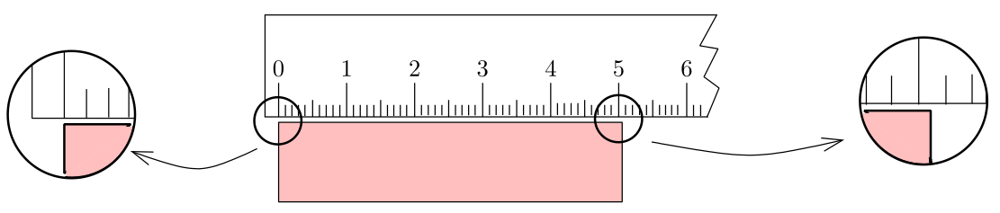

# Measurement
Physics is a "natural" science --- a branch of science dealing with nature and natural phenomena. And like in all other sciences, we need to take measurements frequently. The quantities that can be measured are referred to as *physical* quantities. The act of measurement is essentially a comparison of the given sample under consideration with a **reference standard** (that has been agreed to be called so beforehand). The standard is a physical entity whose choice is determined by the following three major factors:
  
*  ease of availability, 
* ease of reproducibility, and 
* invariance under change in environment. 

For example, the standard of the physical quantity *mass* is a specific cylinder made of an alloy of platinum and iridium kept at the International Bureau of Weights and Measures at Sèvres, France.

## Units for measurement
*The **unit** of a physical quantity is a value of it, in terms of which other quantities of that kind is expressed*[^1]. Generally, the unit of a physical quantity is the measure of the reference standard for that quantity. For example the unit of mass is the *kilogram* (abbreviation kg) which is the mass of the platinum--iridium cylinder mentioned above.

The result of measurement of a physical quantity is reported as a numerical figure followed by a unit which signifies the reference standard chosen. For example, 1.05 kilogram means that our sample has a mass which is 1.05 times the mass of the standard.

Although the number of physical quantities that can be measured are very large, we do not need a very large numbers of units. *A limited number of fundamental units is sufficient for expressing all physical quantities*. These limited number of units are the so called *base* or *fundamental* units and these form a set of independent quantities. It turns out that **only seven base quantities** are required to span the entire collection of physical quantities. By suitable combinations of these seven base units, the units of other physical quantities can be derived and as such they are just called the *derived units*.

## System of units
There are several system of units which have been used for describing measurements. The common systems are given below:

-   The CGS system is based on the three basic units -- the centimeter for length, the gram for mass and the second for time.

-   The FPS system or the British system uses the foot, pound and second respectively for length, mass and time measurement.

-   The MKS system is based on the meter for length, kilogram for mass and second for time.

-   The system which is now internationally accepted is the SI system. (The abbreviation SI comes from the system's French name ***S**ystèm **I**nternationale d'Unitès*.) This is the system that we shall follow.

### The SI system
In the SI system the seven base units are the meter for *length*, the kilogram for *mass*, the second for *time*, the kelvin for *thermodynamic temperature*, the ampere for *electric current*, the candela for *luminous intensity*, and the mole for *amount of
substance*. Besides these base units, there are two *supplementary quantities* and their units. They are the *plane angle* having radians as its unit, and the *solid angle* with unit steradian. Rest all other physical quantities have *derived units*. The base quantities together with the supplementary quantities have been summarized in the following table.

### Base quantities

|   **Sl. no.**    | **Physical quantity**       | **Name of the unit**       | **Symbol**         |
| :--------------: | :-------------------------: | :------------------------: | :----------------: |
| 1.               |  Length                     |  meter                     |   m                |
| 2.               |  Mass                       |  kilogram                  |   kg               |
| 3.               |  Time                       |  second                    |   s                |
| 4.               |  Electric current           |  ampere                    |   A                |
| 5.               |  Thermodynamic temperature  |  kelvin                    |   K                |
| 6.               |  Luminous intensity         |  candela                   |   cd               |
| 7.               |  Amount of substance        |  mole                      |   mol              |

### Supplementary quantities

| **Sl. no.**      | **Physical quantity**       | **Name of the unit**       | **Symbol**     |
| :--------------: | :-------------------------: | :------------------------: | :------------: |
| 8.               |  Plane angle                | radian                     |   rad          |
| 9.               |  Solid angle                | steradian                  |   sr           |

## Abbreviations of powers of 10
To express very large and very small numbers, we generally use the *scientific notation* of representation. Further, to simplify matters,
certain powers of 10 in this system of notation have been given abbreviations, which may be used as *prefixes* before units. These prefixes are shown 
in the following table:

 | **Power of 10** | **Prefix** | **Symbol**|
| :-------------------------------: | :--------------------------------: | :----------------: |
|  $$ 10^{18} $$            |  exa  |         E | 
|  $$ 10^{15} $$            |  peta  |         P |
|  $$ 10^{12} $$            |  tera  |        T  |
|  $$ 10^{9} $$             |  giga   |         G |
|  $$ 10^{6} $$            |  mega  |         M |
|  $$ 10^{3} $$            |  kilo  |         k |
|  $$ 10^{2} $$            |  hecto   |        h |
|  $$ 10^{1} $$            |  deca  |         da |
|  $$ 10^{-1} $$            |  deci |         d |
|  $$ 10^{-2} $$            |  centi |         c |
|  $$ 10^{-3} $$            |  milli |         m |
|  $$ 10^{-6} $$            |  micro |         $$ \mu $$  |
|  $$ 10^{-9} $$            |  nano |         n |
|  $$ 10^{-12} $$            | pico |       p |
 |  $$ 10^{-15} $$            |  femto |         f |
 |  $$ 10^{-18} $$            |  atto|         a |

Thus, 0.0000567 m can be expressed as $$ 5.67\times 10^{-5} $$ m or
56.7 $$ \mu $$m.

# Significant figures
When physical quantities are measured, the measured values are known only to within the limits of the experimental uncertainty. The value of this uncertainty can depend on various factors, such as the quality of the apparatus, the skill of the experimenter, and the number of measurements performed.

Suppose we are trying to measure the length of a small piece of paper with a 15--cm scale which has graduations down to a millimeter. What we do is to align one edge of the paper with the marking on the scale which reads 'zero' and then try to figure out where the second edge is lying.Suppose the situation is as shown in the following figure:

*Measuring the length of a piece of paper using a scale*

From the figure, we are quite sure that the length of the wood is more than 5.0 cm but less than 5.1 cm. But how to report the length? What we now do is to further divide the 1 mm length, mentally, in 10 equal units and try to figure out where the edge lies. Suppose I find that it lies half way between 5.0 and 5.1 markings. So I report the data as 5.05 cm. In this data, the last digit i.e. the digit 5 is uncertain because we did it all in our mind. However, we are quite sure about the first two digits. We say that the reported data contains three significant figures (or sig figs).

> **Significant figures** The number of significant figures (digits) is the number of certain figures (digits) plus the last uncertain figure (digit).

The leftmost (non--zero) digit is the most significant while the rightmost digit is the least significant. The greater the number of significant figures, the greater is the
information in the data (or the more precise the data becomes).

## General rules

### Determining the number of significant figures
The following are the rules that are commonly followed for determining the number of significant figures:

-   All non--zero digits are significant.

-   All zeros occurring between two non--zero digits are significant.

-   In a number less than one, all zeros to the right of the decimal point and to the left of the first non--zero digit are not significant.

-   All zeros to the right of the last non--zero digit in the decimal part are significant.

-   In a number with no decimal point, only the zeroes in between non-zero digits are significant; the leading and the trailing zeroes are not significant.

For example, 1.0900 m has five significant figures whereas 0.0090 m has only two.

### In arithmetical operations
The question now arises that what rules should be followed when we are multiplying, dividing, adding or subtracting numbers involving different number of significant figures. The fact underlying all the rules for these arithmetical operations is simply this: **the result should not be more precise than the least precise of the numbers we started with**.

1.  **Multiplication/Division:** We just note down, what is the least number of significant figures involved in all the data. Then we proceed with the operation with the numbers. Finally, we show the result with the noted number of significant figures after appropriate rounding off. For example: suppose we need to multiply 2.104 m with 9.8 m. We note that the least number of significant figures is two in the second datum. Now, we simply multiply the two getting 20.6192 m$$ ^2 $$. While showing the result, we must truncate the product so that the number of significant figures are only two. So after necessary rounding off, we show the result as 21 m$$ ^2 $$.

2.  **Addition/Subtraction:** In this case, we align the decimal point along a column and then proceed with the operation. Once we have the result, we show the final answer, after truncating to the least number of decimal places involved in any of the numbers. For example upon adding 14.785 m and 9.03 m, we get 23.815 m. But since the smaller number of decimal point is two (in the second datum), so the answer must contain only two decimal places and so the final result after appropriate rounding off is 23.82 m.

### Rules for rounding off
While rounding off, we should keep the following rules in mind. First, determine after what decimal place you have to truncate the result. Then proceed as follows:

-   If the digit just to the right is greater than five, increase the digit at the required decimal place by one taking the carry if it is there (just like addition).

-   If the digit just to the right is less than five, leave it as it is.

-   If the digit just to the right is equal to five, then look at the digit at the required decimal position. If it is even, leave it as it is, otherwise increase by one.

# Errors

We do all measurements with the help of instruments. Since all instruments have a certain resolution beyond which they can not be precise, there is invariably some uncertainty in the measured value of the physical quantity. This *uncertainty* is called *error*. The error in a measured quantity gives an indication of the limits within which the true value of the physical quantity may lie. For example, in the p  the true length of the paper lies within 5.0 cm and 5.1 cm.

## Classification

There are several causes for errors in measurements. Based on their cause, we may classify errors into three broad categories: **systematic errors**, **random errors**, and **gross errors**.

### Systematic errors
These are the errors whose causes are known and, hence, can be minimized. For example:

-   *least count error:* it is associated with the resolution of the instrument, i.e. the minimum measurement that can be precisely performed using a certain instrument;

-   *resolution of the experiment:* different experimental methods will have different units of resolution and hence errors;

-   *instrumental error:* arising out of erroneous manufacture of instruments or using instruments having zero--error;

-   *personal error:* arising out of carelessness or deficiency of the observer e.g. a person holding his head a bit too far to the right while reading a needle on the scale and thus introducing an error due to parallax.

### Gross errors
These errors are due to the sheer carelessness of the experimenter. For example, taking the reading without proper adjustment of the apparatus, recording the readings incorrectly etc. These can be lessened if the experimenter is mentally alert and sincere.

### Random errors
These are errors that occur irregularly and hence are random with respect to sign and size. They can be taken care by repeating the measurements several times and average of the values
taken. Normally, statistical methods are used to analyze data containing random errors.

## Expressing errors quantitatively
As already mentioned, random errors can be minimized by repeating the measurements many times and taking their average value or the arithmetic mean as the "true" value of the measured quantity.

**Mean value.** Suppose we are trying to measure a physical quantity $$ A $$. Let us denote its value as $$ a $$ and further suppose that the values obtained in several measurements are $$ a_1 $$, $$ a_2 $$, $$ a_3 $$, ..., $$ a_n $$. Their arithmetic mean is 

$$
\overline{a} = \frac{a_1+a_2+a_3+\cdots+ a_n}{n} =\frac{1}{n}\sum_{i=1}^n a_i
$$

This value is taken as the true value of the quantity $$ A $$ under the conditions of measurements, because it is reasonable to suppose that individual measurements are as likely to
overestimate as to underestimate the true value of the physical quantity.

### Absolute error
*The magnitude of the difference between the value of the quantity and the individual measurement value* is called the *absolute error* of the measurement. This is denoted by $$ |\Delta a| $$. Since the true value is unknown, let us accept the mean as the true value. Then the absolute errors in our measurements are 

$$
\begin{aligned}
|\Delta a_1|&= \vert \overline{a} -a_1 \vert \\
|\Delta a_2|&= \vert \overline{a} -a_2 \vert \\
&\vdots \\
|\Delta a_n|&=\vert \overline{a} -a_n \vert
\end{aligned}
$$

Finally, the arithmetic mean of all these absolute errors is taken to be the absolute error in the measured value of the quantity 

$$
\overline { |\Delta a|} = \frac{|\Delta a_1|+|\Delta a_2|+|\Delta a_3| + \cdots + |\Delta a_n|}{n}=\frac{1}{n}\sum_{i=1}^n |\Delta a_i|
$$

If we do a single measurement, the value we get may be in the range $$ \overline{a} \pm \overline{|\Delta a|} $$.
### Relative and percentage error
Often, instead of the absolute error, we use the *relative error* and *percentage error*. *The ratio of the absolute error to the value of the quantity being measured* is called the *relative or fractional error*. When expressed in percentage, it becomes percentage error:

$$
\text{percent error } = \frac{\overline{|\Delta a|}}{\overline{a}} \times 100
$$

Let us consider an example.

***Example* 1**. The refractive index of water was measured. In successive measurements, the readings turn out to be 1.29, 1.33, 1.34, 1.35, 1.32, 1.36, 1.30, 1.33.
Thus, the mean value of the refractive index, taken to be the actual value is

$$
\mu=\frac{1.29 + 1.33 + 1.34 + 1.35 + 1.32 + 1.36 + 1.30 + 1.33}{8} =1.3275=1.33
$$

The absolute errors are 

$$
\begin{aligned}
|\Delta\mu_1|&=|1.33-1.29|=0.04\\
|\Delta\mu_2|&=|1.33-1.33|=0.00\\
|\Delta\mu_3|&=|1.33-1.34|=0.01\\
|\Delta\mu_4|&=|1.33-1.35|=0.02\\
|\Delta\mu_5|&=|1.33-1.32|=0.01\\
|\Delta\mu_6|&=|1.33-1.36|=0.03\\
|\Delta\mu_7|&=|1.33-1.30|=0.03\\
|\Delta\mu_8|&=|1.33-1.33|=0.00
\end{aligned}
$$

Hence, the mean absolute error is

$$
\overline{|\Delta \mu|} =\frac{0.04+ 0.00 + 0.01 + 0.02 + 0.01 + 0.03 + 0.03 + 0.00}{8} = \frac{0.14}{8} = 0.0175 = 0.02
$$

Hence, the refractive index of water is $$ \mu = 1.33 \pm 0.02 $$. Further, the percentage error 

$$
 = \frac{0.02}{1.33}\times 100 = 1.5~\%
$$

## Combination of errors
If we do an experiment involving several measurements, we must know how the error combines in the process of addition, subtraction, multiplication and division. The procedure is outlined below:

-  *Error of a sum or a difference.* Suppose two quantities $$ A $$ and $$ B $$ have measured values $$ \alpha\pm\Delta\alpha $$ and $$ \beta  \pm\Delta\beta$$, respectively, where $$\Delta\alpha $$ and $$ \Delta\beta $$ are the corresponding absolute errors. We wish to find the absolute error $$ \Delta \zeta $$ in their sum $$ Z=A+B $$. We have by addition, 

  $$ 
   \zeta \pm \Delta\zeta =     (\alpha\pm\Delta\alpha)+(\beta\pm\Delta\beta) = (\alpha +\beta) \pm  (\Delta\alpha+\Delta\beta)
  $$ 
   
  Thus the maximum possible error in their sum is $$ \Delta\alpha + \Delta\beta $$. For the difference, $$ Z=A-B $$, 

  $$
   \zeta\pm\Delta\zeta =(\alpha\pm\Delta\alpha)-(\beta\pm\Delta\beta) =    \alpha-\beta\pm\Delta\alpha\pm\Delta\beta
   $$

   And so, $$ \pm\Delta\zeta =\pm\Delta\alpha\pm\Delta\beta $$. The maximum possible error is again $$ \Delta\alpha + \Delta\beta $$. Hence the rule: *when two quantities are added or   subtracted, the absolute  error in the final result is the sum of the absolute errors in the quantities.*

-  *Error of a product or a quotient.* Suppose $$ Z=AB $$ and the measured values $$ \alpha\pm\Delta\alpha $$ and $$ \beta \pm\Delta\beta $$, respectively. Then, the value of $$ Z $$ 

    $$
    \begin{aligned}
    \zeta\pm\Delta\zeta &=(\alpha\pm\Delta\alpha)(\beta \pm\Delta\beta)  \\
    &= \alpha\beta \pm \alpha\Delta\beta \pm \beta\Delta\alpha \pm \Delta\alpha\Delta\beta\\
    \Rightarrow 1\pm\frac{\Delta\zeta}{\zeta} &= 1 \pm \frac{\Delta\alpha}{\alpha} \pm \frac{\Delta\beta}{\beta} \pm \frac{\Delta\alpha}{\alpha}\cdot\frac{\Delta\beta}{\beta}
    \end{aligned}
    $$
    
    Since, $$ {\displaystyle\frac{\Delta\alpha}{\alpha}} $$  and $$ {\displaystyle\frac{\Delta\beta}{\beta}} $$ are much smaller compared to unity, their product can be neglected. Hence, the maximum error in $$Z$$ is 
    
    $$
    \frac{\Delta\zeta}{\zeta} =\frac{\Delta\alpha}{\alpha} +  \frac{\Delta\beta}{\beta}
    $$ 
    
    This result holds true for division as well. Hence, *when two quantities are multiplied or divided, the fractional error in the result is the sum of the fractional errors
    in individual quantities.*

# Dimensional analysis
In physics, the word "dimension" has a special meaning. It usually denotes the physical nature of a quantity. Whether a distance is measured in the unit feet or the unit meter, it is still a distance. We say the dimension -- the physical nature -- of distance is *length*.

## Dimensional formula
Generally, the symbol $$ L $$, $$ M $$ and $$ T $$ are used to denote the physical quantities of length, mass and time, respectively. Further, $$ \theta $$ denotes the temperature and $$$ I $$ the electric current. To denote the amount of substance and luminous intensity, we can use their respective symbols.

Following a convention suggested by Maxwell, we denote the dimensions of a physical quantity $$ \phi $$ by $$ [\phi] $$. Thus, for example, if $$x$$ denotes the distance traveled by a particle, $$ [x]=L $$. *For a derived quantity, its **dimensional formula** expresses the way in which the base quantities combine to give the units of that derived quantity.* For
example, if $$v$$ be the velocity, then $$[v]=LT^{-1}$$. A dimensionless quantity would have $$[\phi] = 1$$. This means that in all system of units, its numerical value would be the same. The following table gives the dimensional formula of some commonly encountered quantities. Of course, the list is not exhaustive.

### Dimensional formulae of some derived quantities

| **Sl. No.** | **Physical Quantity** | **Dimensional formula** |
|:-----------:|:---------------------:|:-----------------------:|
|  1. | Area | $$L^2$$ |
|  2. | Volume | $$L^3$$ |
|  3. | Mass density | $$ML^{-3}$$ |
|  4. | Velocity | $$LT^{-1}$$ |
|  5. | Acceleration | $$LT^{-2}$$ |
|  6. | Momentum | $$MLT^{-1}$$ |
|  7. | Force | $$MLT^{-2}$$ |
|  8. | Energy | $$ML^2T^{-2}$$ |
|  9. | Power | $$ML^2T^{-3}$$ |
| 10. | Pressure | $$ML^{-1}T^{-2}$$ |
| 11. | Torque | $$ML^2T^{-2}$$ |
| 12. | Moment of inertia | $$ML^2$$ |
| 13. | Entropy | $$ML^2T^{-2}\theta^{-1}$$ |
| 14. | Specific heat | $$L^2T^{-2}\theta^{-1}$$ |
| 15. | Thermal conductivity | $$MLT^{-3}\theta^{-1}$$ |
| 16. | Electric charge | $$IT$$ |
| 17. | Permittivity | $$M^{-1}L^{-3}T^4I^2$$ |
| 18. | Capacitance | $$M^{-1}L^{-2}T^4I^2$$ |
| 19. | Electric field | $$MLT^{-3}I^{-1}$$ |
| 20. | Electric potential | $$ML^2T^{-3}I^{-1}$$ |
| 21. | Resistance | $$ML^2T^{-3}I^{-2}$$ |
| 22. | Magnetic flux | $$ML^2T^{-2}I^{-1}$$ |
| 23. | Permeability | $$MLT^{-2}I^{-2}$$ |
| 24. | Magnetic field | $$MT^{-2}I^{-1}$$ |
| 25. | Inductance | $$ML^2T^{-2}I^{-2}$$ |
| 26. | Angular momentum | $$ML^2T^{-1}$$ |
| 27. | Frequency | $$T^{-1}$$ |
| 28. | Gravitational constant | $$M^{-1}L^3T^{-2}$$ |
| 29. | Viscosity | $$ML^{-1}T^{-1}$$ |
| 30. | Angle | $$1$$ |

Note that all the dimensional formulae listed in are product of *power law monomials*, of the form $$[\phi] = M^a L^b T^c \theta^d\ldots$$ where $$a$$, $$b$$, $$c$$, $$d$$ ...are constants. In fact, this is a general result which can be proved mathematically.

## Dimensional analysis
**Whenever an equation is written, the 'net' dimensions on both sides of the equality sign must be the same**. This statement is known as the **principle of homogeneity of dimensions** and really is the key to all kinds of dimensional analysis. This principle is very useful, as we shall see shortly.

Another concept that is useful is that of **independence of dimensions**. *A set of quantities $$(q_1$$, $$q_2$$, ..., $$q_k)$$ are said to be dimensionally independent if none of these quantities have dimensions which can be represented as a product of powers of the dimensions of the remaining quantities*. Alternatively, no combination of a set of independent quantities will result in a dimensionless quantity.

For example, density ($$[\rho]=ML^{-3}$$), velocity ($$[v]=LT^{-1}$$) and force ($$[F]=MLT^{-2}$$) form a set of independent quantities[^2]. On the other hand, the density, velocity, and pressure ($$[p]=ML^{-1}T^{-2}$$) are not independent since $$[p]=[\rho][v]^2$$ i.e. the quantity $$p/\rho v^2$$ is dimensionless.

Now suppose we have a relationship between a quantity $$q$$ which is being determined in some experiment (which we will refer to as the *governed parameter*), and a set of quantities $$(q_1$$, $$q_2$$, ..., $$q_n)$$, which are under experimental control (the *governing parameters*). Further let us assume that this relationship is of the form 

$$
q=f(q_1,\,q_2,\,\ldots,q_k,\,q_{k+1},\,\ldots,q_n)
$$ 

where $$(q_1$$, $$q_2$$, ..., $$q_k)$$ have independent dimensions. This would mean that the dimensions of the governed parameter $$q$$ is determined by the dimensions of $$(q_1$$, $$q_2$$, ..., $$q_k)$$, and all of the $$q_s$$'s with $$s>k$$ can be written as products of powers of of the dimensions of $$(q_1$$, $$q_2$$, ..., $$q_k)$$. With these definitions, it is possible to prove that can be written as: 

$$
\label{eq:dcenter}
q=q_1^\alpha\ldots q_k^\gamma \,
\Phi\left(\frac{q_{k+1}}{q_1^{\alpha_{k+1}}\ldots
q_k^{\gamma_{k+1}}},\,\ldots,\,\frac{q_{n}}{q_1^{\alpha_{n}}\ldots
q_k^{\gamma_{n}}}\right)
$$ 

with $$\Phi$$ some function of *dimensionless quantities only* and $$\alpha$$, ..., $$\gamma$$, $$\alpha_{k+1}$$, ..., $$\gamma_{k+1}$$, $$\alpha_n$$, ..., $$\gamma_n$$ are some real numbers. The great simplification is that while the function $$f$$ in was a function of $$n$$ variables, the function $$\Phi$$ in  is a *function of only $$n-k$$ variables*. The above idea is a mathematical statement of **Buckingham's $$ \Pi $$ Theorem** which is the central result of dimensional analysis. Dimensional analysis cannot supply us with the dimensionless function $$\Phi$$ --- we need a *real theory* for that.

Dimensional analysis can be used to (i) check the correctness of a given expression or equation; and (ii) derive a formula for a physical quantity. We take a look at a few examples.

***Example* 2**. Which of the formulae for kinetic energy, KE, of a mass $$m$$ moving with a velocity $$v$$ given below are dimensionally consistent?
($$a$$ is the acceleration, $$t$$ is the time.) 
(a) KE = $$m^2v^2$$; (b) KE = $$\frac{1}{2}mv^2$$; (c) KE = $$ma$$; (d) KE = $$\frac{3}{16}mv^2+mva$$.

*Solution:* Every correct formula or equation must have the same dimensions on both side of the equality sign. Also, only quantities with the same dimensions can be added or subtracted. Now, $$ KE  =  ML^2T^{-2}$$. On the right hand side of the equality signs, the quantities have the following dimensions: $$M^2L^2T^{-2}$$ for (a); $$ML^2T^{-2}$$ for (b); $$MLT^{-2}$$ for (c). Quantities having different dimensions have been added in (d). Consequently, only (b) is dimensionally consistent.

***Example* 3** (**Frequency of simple pendulum.**). Derive, using dimensional analysis, the expression for the angular frequency $$\omega$$ of small oscillations of a simple pendulum which is a point mass $$m$$ tied to a string of length $$l$$.

*Solution:* Here $$\omega$$ is the governed parameter. The question arises that on what factor it might depend. Of course, the mass, $$m$$, is a factor and so is the length $$l$$. Since, the entire set up is near the surface of the Earth, the acceleration due to gravity $$g$$ also comes into picture. Further, these three quantities are dimensionally independent. Hence, the function $$\Phi$$ is just a constant. So let us assume that $$$$\omega = C m^\alpha l^\beta g^\gamma$$$$ where $$C$$, $$\alpha$$, $$\beta$$ and $$\gamma$$ are constants. Taking into account that $$[C]=1$$, $$[\omega]=T^{-1}$$, $$[m]=M$$, $$[l]=L$$ and $$[g]=LT^{-2}$$, we obtain

$$
T^{-1}=M^\alpha L^\beta (LT^{-2})^\gamma = M^\alpha L^{\beta+\gamma}
T^{-2\gamma}
$$ 

By the principle of homogeneity, we obtain, by comparing the exponents, $$\alpha =0$$, $$\beta +\gamma =0$$ and $$-2\gamma =-1$$. Solving the latter two, we obtain $$\gamma = 1/2$$ and $$\beta = -1/2$$. 
Thus, 

$$
\omega = C\sqrt{\frac{g}{l}}
$$

A few comments are in order: (1) the frequency is independent of the mass of the pendulum bob, a somewhat surprising conclusion to the uninitiated; (2) the constant cannot be determined from dimensional analysis alone. These results are typical of dimensional analysis --- uncovering often unexpected relations among the variables, while at the same time failing to pin down numerical constants. Indeed, to fix the numerical constants we need a *real theory* of the phenomena in question, which goes beyond dimensional considerations.

***Example* 4** (**Gravity waves on water.**). Consider waves on the surface of water, which are called *gravity waves* (or sometimes *capillary waves*). In wave motion, the distance between two successive crests or troughs is called the wavelength, $$\lambda$$ and the quantity $$k=2\pi/\lambda$$ is called the wave number. The relation between the angular frequency $$\omega$$ and $$k$$ is known as the *dispersion relation*: $$\omega = \omega(k)$$. For most waves, e.g. sound waves, light waves or even the waves on a stretched string, the dispersion relation is $$\omega =kv$$, where $$v$$ is the wave velocity. 
*Question:* How does angular frequency, $$\omega$$, of water wave depends on the wave number $$k$$?

*Solution:* The relevant variables seems to be the density of water $$\rho$$; acceleration due to gravity $$g$$; and of course the wave number $$k$$, which have dimensions: $$[\rho] = ML^{-3}$$, $$[g]=LT^{-2}$$, and $$[k]=L^{-1}$$. these quantities have independent dimensions and hence the function $$\Phi$$ is again a constant. Thus 

$$
\begin{aligned}
&=&T^{-1}\\
&=&[\rho]^a[g]^b[k]^c\\
&=& M^a\, L^{-3a+b-c}\, T^{-2b}
\end{aligned}
$$

so that $$a=0$$, $$-3a+b-c=0$$, and $$-2b=-1$$. with the solution $$a=0$$, $$b=c=1/2$$. Therefore, 

$$
\omega = C\sqrt{gk}
$$ 

with $$C$$ another undetermined constant. We see that the frequency of water waves is proportional to the square root of the wave number, in contrast to sound or light waves, for which the frequency is proportional to the wave number. This fact has some significant consequences.

You might worry about the effects of surface tension $$\sigma$$ on the dispersion relationship. We can include it in our dimensional analysis by noting that the surface tension is the energy per unit area of the surface of the water, so it has dimensions $$[\sigma] = MT^{-2}$$. The dimensions of the surface tension are not independent of the dimensions of $$\rho$$, $$g$$ and $$k$$. in fact, it is easy to show that $$[\sigma] = [\rho][g][k]^{-2}$$, so that $$\sigma k^2/\rho g$$ is dimensionless. Then using the same arguments as before, we have

$$
\omega = \sqrt{gk}\,\Phi\left(\frac{\sigma k^2}{\rho g}\right)
$$

with $$\Phi$$ some undetermined function. A calculation of the dispersion relation for gravity waves starting from the fundamental equations of fluid mechanics gives

$$
\omega =\sqrt{gk}\,\sqrt{1+\frac{\sigma k^2}{\rho g}},
$$

so that our function $$\Phi(x)=\sqrt{1+x}$$. Dimensional analysis enabled us to deduce the correct form of the solution, i.e., the possible combinations of the variables. Of course, only a complete theory could provide us with the function $$\Phi(x)$$.

***Example* 5** (**Energy in nuclear explosion.**). We next turn to a famous example worked out by the eminent British fluid dynamicist G. I. Taylor[^3]. In a nuclear explosion there is an essentially instantaneous release of energy $$E$$ in a small region of space. This produces a spherical shock wave, with the pressure inside the shock wave thousands of times greater that the initial air pressure, which may be neglected. How does the radius $$R$$ of this shock wave grow with time $$t$$?

*Solution:* The relevant governing variables are $$E$$, $$t$$ and the initial air density $$\rho_0$$, with dimensions $$[E]=ML^2T^{-2}$$, $$[t]=T$$, and $$[\rho_0] = ML^{-3}$$. This set of variables has independent dimensions so that $$\Phi$$ is just a constant function. We next determine the exponents: 

$$
\begin{aligned}
&=L\\
&=[E]^a[\rho_0]^b[t]^c\\
&= M^{a+b}\, L^{2a-3b}\, T^{-2a+c}
\end{aligned}
$$

so that $$a+b=0$$, $$2a-3b=1$$, and $$-2a+c=0$$, with the solution $$a=1/5$$, $$b=-1/5$$ and $$c=2/5$$. Therefore,

$$
R=C\left(\frac{Et^2}{\rho_0}\right)^{1/5}
$$ 

with $$C$$ an undetermined constant.

If we could plot the radius $$R$$ of the shock as a function of time $$t$$ on a log--log plot, the slope of the line should be $$2/5$$. The intercept of the graph would provide information about the energy $$E$$ released in the explosion, if the constant $$C$$ could be determined. By solving a model shock-wave problem Taylor estimated $$C$$ to be about 1; he was able to take declassified movies of nuclear tests, and using his model, infer the yield of the bombs. This data, of course, was strictly classified; it came as a surprise to the American intelligence community that this data was essentially publicly available to those well versed in dimensional analysis.

# Conclusion

We have seen in this topic, what role the units, dimensions and significant figures play in the general structure of physics. What is expected of you is to follow the general rules outlined above. Try to be proficient in dimensional analysis and always use the appropriate units. Follow as far as possible the rules of the game.

[^1]: The unit is chosen arbitrarily but then agreed upon universally.

[^2]: You can prove this by formally writing $$ [F]^a[v]^b[\rho]^c=1 $$ and
    then showing that only solution to this equation is $$ a=b=c=0 $$.

[^3]: Taylor's name is associated with many phenomena in fluid
    mechanics: the Rayleigh--Taylor instability, Saffman--Taylor
    fingering, Taylor cells, Taylor columns, etc.
